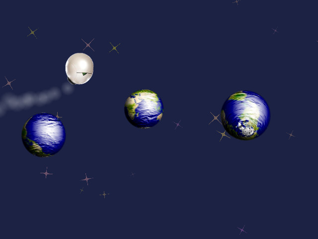

# space-adventure

**WebGL progressive app** which installs itself on the home screen of your smartphone.
This project is a simple game's prototype with a lot of comments and explanations.

[](https://tolokoban.github.io/space-adventure)

You can test it by clicking on the above picture.
_(try to refresh if you get a strange error)_

## Progressive app

We want our app to behave like a standalone app on Android smart phones.
That means three things:
* We want our game to be displayed in full screen and not in a browser.
* We want be able to play even if the network is out of order.
* We want a nice icon on our home screen.

This is now made possible with the [progressive app](https://developers.google.com/web/updates/2015/03/increasing-engagement-with-app-install-banners-in-chrome-for-android?hl=en) paradigm.

For this, we need [a manifest](src/mod/manifest.json) and a [service worker](src/mod/offline.wrk).

## WebGL

The game is ridiculously simple: you control a ship in a space full of planets (actually all the planets look like the Earth).
When you hit a planet, it will explode in the very next second. For this, we have 5 main modules:
* __[stars.js](src/mod/stars.js)__: In the background we can see a stars field.
    * Each star rotates and moves horizontally.
    * The more the star is far, the more it moves slowly and the more it looks smaller and darker.
    * No texture is used. The four pointed star shape is made mathematically.
    * All the stars field animation is fully managed by the GPU. No Javascript is used, only GLSL (shading language).
* __[moon.js](src/mod/moon.js)__: This module deals with the planets.
    * The planet is the Earth. Therefore, you can see the spherical mapping of the [texture](src/mod/app/earth.png).
    * It can rotate freely on all axis.
    * It is enlighten to make it look as a real sphere and not just the disk that it really is.
    * It has a rough surface to test [normals mapping](src/mod/app/moon.png).
    * It becomes orange when hit by the hero. The transition between initial colors and orange takes .5 seconds.
* __[hero.js](src/mod/hero.js)__: The hero is a picture of the [Marvin](https://en.wikipedia.org/wiki/Marvin_(character))'s head.
    * It has a little deformation while it is still to give the impression of speed.
    * It becomes red after a collision with a planet.
* __[smoke.js](src/mod/smoke.js)__: The hero's ship produce a lot of smoke. This is usefull to give a better impression of move.
    * This is a particle system: javascript only creates new particles, the rest is entirely managed by the GPU.
    * Smoke turns black just after a collision.
* __[explo.js](src/mod/explo.js)__: We need an animation for planet destruction.
    * No texture is used: only mathematic.
    * Explosion grows and fade out.
    
## General architecture

Making WebGL games is writing garbage-collector friendly code.
So we must avoid as much objects creation as possible.
Ofcourse, there is a tradeoff to find between speed and code readability.
That's why we use modules, but we do all the object creation before the animation loop starts.

We also use the ToloFrameWork. Not because it is the best one around, but only because it is **our** framework ;-)
So if the code seems strange to you, just think about [modules in `node.js`](https://nodejs.org/api/modules.html).

The starting module is [app.js]()scr/mod/app.js).

## Test it at home

Now, the best thing to do is looking at the code and modifying it to test around.
You can get the code like this:
```
git clone https://github.com/tolokoban/space-adventure.git
cd space-adventure
npm update
```

To compile it in debug mode ang get the result in the `www/` folder, type:
```
npm run watch
```
